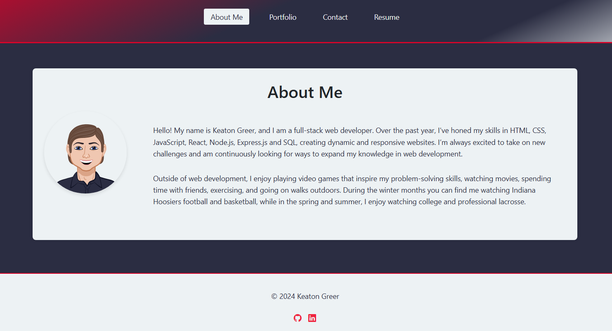

# React Portfolio
    

## Description
Portfolio website created with React.js

## Table of Contents
- [Usage](#usage)
- [License](#license)
- [Tests](#tests)
- [Questions](#questions)

## Usage
You can visit the deployed site [here](https://keatongreerportfolio.netlify.app/)

## License
This project is covered under the following license: MIT License

## Tests
This project was tested using Visual Studio Code and Netlify for deployment

## Questions
Github: keatongreer

Contact me at keatongreer1@gmail.com with any questions
